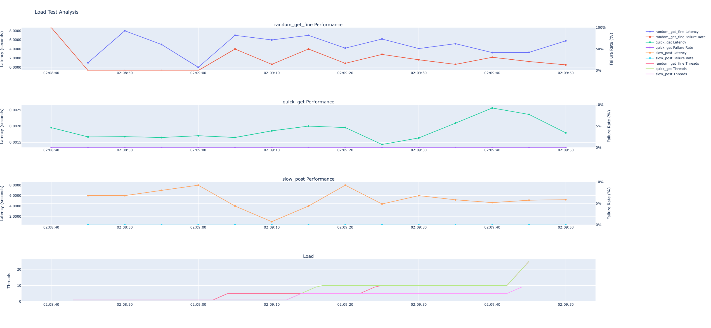

# Installation

Required python > v3.8
`pip install -r requirements.txt`

# Usages

## Quick glance of output

With the `data/`'s previous test result, after installation you are welcome to directly run the analyze_app.py and see localhost:8081 to 
view the graphs to get a glance view of the outcome.

## Run local setup

1. Run the sample server for test endpoints. `python server.py`
2. Configure the configs for testing. `config.yaml`. Default setting is connected to local server
3. Run tester. `python tester.py`.

# Architectural

## Load Tester

1. `tester.py` is the entry point for running the load test and `tests/` folder has all component for load testing
2. `tester.py` calls into `SchedulerThread` for each task/request_name
3. `SchedulerThread` calls into `RequestThreadManager` to tune up/down number of `RequestThread`s to send `Request`
4. Separately, `Metrics` singleton manages the threads to do logging that's published by the threads from `RequestThread` and more.

## Server

A simple server that receives http calls from the load tester for both get and post. Some APIs returns failures and some takes time to return.

## Analyzer

The module that uses the published data to show results. There are two ways to access it:
1. `python Analyzer.py` directly access a current snapshot of data graph. Default is the data under `data/` folder
2. `python analyze_app.py` will open a localhost:8081 to access live graph with csvs in `data/`.

## Logging

You can mute some actors (class_name) by not allowing them, or you can allow all. Actors not in the allow list will be muted.

# Demo Images

<video width="760" height="360" controls>
  <source src="demo/video.mov" type="video/mp4">
</video>

